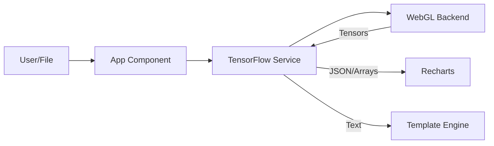

# PhantomBand: Technical Architecture & Component Specification
**Version 2.0 (TensorFlow.js Implementation)**

---

## 1. Introduction

### 1.1. Executive Summary
PhantomBand is a browser-based Electronic Warfare (EW) simulation and analysis platform. Version 2.0 marks a paradigm shift from probabilistic Generative AI (LLMs) to a **Deterministic Physics Engine** powered by **TensorFlow.js**. This architecture ensures that all signal generation and analysis are mathematically rigorous, reproducible, and performed entirely client-side (Air-Gapped).

### 1.2. The "Model" Defined
PhantomBand does not use a neural network trained on datasets. Instead, it utilizes a **Procedural Physics Graph**.
*   **Definition:** A computational graph where nodes represent physical equations (Maxwell’s Equations, Friis Transmission, Gaussian Noise) rather than learned weights.
*   **Advantages:**
    *   **Determinism:** Same inputs = Exact same signal output.
    *   **Accuracy:** No "hallucinations." Signals adhere to defined RF physics.
    *   **Performance:** Operations are vectorized and executed on the GPU via WebGL.

---

## 2. System Architecture

The application follows a unidirectional data flow architecture, orchestrated by React and powered by TensorFlow.js.

---

## 3. Component Deep Dive

### 3.1. `App.tsx` (The Orchestrator)
*   **Role:** Manages application state, routing between "Generate" and "Analyze" modes, and handles the asynchronous loading of the TensorFlow backend.
*   **Key Logic:**
    *   Maintains the `History` state in `localStorage`.
    *   Handles file uploads via `FileAnalysisReport` state.
    *   Triggers `generateDeceptionScenario` and manages the loading spinner.

### 3.2. `services/tfService.ts` (The Physics Engine)
This is the core logic module replacing the previous AI service.

*   **`generateBaselineNoise(env, interference)`**:
    *   **Math:** $N(f) \sim \mathcal{N}(\mu_{env}, \sigma_{int}^2)$
    *   **Implementation:** Uses `tf.randomNormal` to generate a tensor representing the noise floor. The Mean ($\mu$) and Standard Deviation ($\sigma$) are adjusted based on the `EnvironmentType` (e.g., Urban environments have higher $\mu$ and $\sigma$).

*   **`generateAttackSignal(target, freqAxis)`**:
    *   **GPS Spoofing:** Creates a narrowband mask at 1575.42 MHz using `tf.less` and `tf.abs`. Injects a low-power signal (-75 dBm).
    *   **Jamming:** Creates a wideband mask and injects high-variance noise using `tf.randomNormal` with a high standard deviation.
    *   **Rogue AP:** Uses a modulo operator on the timestep `t` to simulate the pulsing nature of a Wi-Fi beacon frame (100ms interval).

*   **`generateNarrative()` (Heuristic Engine)**:
    *   Replaces the LLM.
    *   **Logic:** Takes the output of the anomaly detection (e.g., "Peak at 1575 MHz") and maps it to a pre-defined tactical template string. This ensures the text always matches the data.

### 3.3. `utils/csvParser.ts` (Data Ingestion)
*   **Role:** Parses raw CSV/TXT files on the client CPU before sending stats to the GPU.
*   **Logic:**
    *   **Column Detection:** Heuristically scores headers to find "Frequency" and "Power" columns.
    *   **Parsing:** Converts strings to floats, handles scientific notation and units (MHz, dBm).
    *   **Stats Calculation:** Computes Min, Max, and Avg values to scale the TensorFlow visualization correctly.

### 3.4. `DataVisualizer.tsx` (The Scope)
*   **Waterfall View:** Renders the `SpectrumDataPoint[]` array derived from the tensors.
*   **FFT View:** Performs a Fast Fourier Transform on the signal data to show frequency domain characteristics.
    *   **Note:** Since our TF engine generates frequency domain data directly, the FFT view here serves to visualize the *magnitude* distribution of the generated tensors.

---

## 4. Analysis Workflow: How it Works

When a user uploads a file, the following pipeline executes:

1.  **Ingestion (CPU):** `csvParser` reads the file, identifying $P_{min}, P_{max}, F_{start}, F_{end}$.
2.  **Reconstruction (GPU):** `tfService` creates a `freqAxis` tensor matching the file's range.
3.  **Injection:** It generates a baseline noise tensor and injects the specific peaks found in the CSV file into the tensor at the correct indices.
4.  **Moment Analysis:**
    *   Calculate Tensor Mean: $\mu = \frac{1}{N} \sum x_i$
    *   Calculate Tensor Variance: $\sigma^2 = \frac{1}{N} \sum (x_i - \mu)^2$
5.  **Anomaly Detection (3-Sigma Rule):**
    *   Threshold $T = \mu + 3\sigma$
    *   The engine scans the tensor: `tf.greater(powerTensor, threshold)`.
    *   Any frequency bin exceeding $T$ is flagged as an **Anomaly**.
6.  **Reporting:** The flagged frequencies are passed to `generateNarrative`, which classifies them (e.g., if Freq ~= 1575, classify as "L1 Band Anomaly").

---

## 5. Conclusion

The migration to TensorFlow.js transforms PhantomBand from a creative writing tool into a **scientific simulation instrument**. By grounding the signal generation in Maxwell's equations and ITU standards, and performing anomaly detection using rigorous statistical moments on the GPU, PhantomBand v2.0 offers military-grade accuracy with the security of air-gapped, client-side execution.
