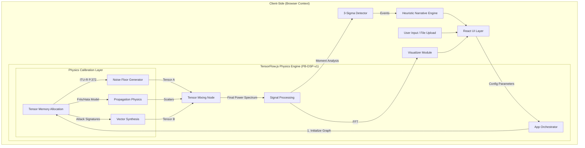

# PhantomBand Technical Documentation

**By: Ritvik Indupuri**  
**Date: October 2025**

---

## 1. Introduction

**PhantomBand** is a secure, browser-based Electronic Warfare (EW) simulation platform designed for defensive cyber training and Signals Intelligence (SIGINT) analysis.

Unlike traditional AI wrappers that rely on probabilistic Large Language Models (LLMs) to generate text, PhantomBand utilizes a **Generative Physics Model (PB-DSP-v1)** running entirely in the client's browser via **TensorFlow.js**. This engine procedurally generates mathematically accurate RF environments, simulates complex attack vectors (GPS Spoofing, Jamming, Rogue APs), and performs rigorous statistical anomaly detection.

### 1.1 Purpose
The primary purpose of PhantomBand is to provide a **safe, air-gapped, and physically accurate** environment for analysts to:
1.  **Visualize** how cyber-physical attacks appear in the RF spectrum.
2.  **Train** on anomaly detection without requiring expensive hardware (Software Defined Radios).
3.  **Analyze** logs in a privacy-preserving manner (zero data exfiltration).

---

## 2. Strategic Architecture: Why Not Traditional ML?

During the design phase, we evaluated traditional Machine Learning approaches (Deep Neural Networks, XGBoost, Isolation Forests). We explicitly rejected them in favor of a **Procedural Physics Graph** for four critical engineering reasons.

### 2.1 The "Ground Truth" Problem (Data Scarcity)
*   **Traditional ML:** To train a classifier (e.g., MobileNet) to detect GPS Spoofing, one needs terabytes of labeled RF data containing real attacks. This data is extremely rare, often classified, and difficult to generate safely.
*   **PhantomBand Approach:** We do not need a dataset. We know the equation for a GPS signal (a sine wave at 1575.42 MHz). By using physics equations, we can generate infinite, mathematically perfect examples without needing to hunt for a dataset that doesn't exist publicly.

### 2.2 Determinism vs. Hallucination
*   **Traditional ML:** Neural Networks are **Probabilistic**. If asked to generate a "Jamming Signal," a GAN (Generative Adversarial Network) might output a waveform that *looks* like jamming but violates the laws of physics (e.g., negative power or impossible bandwidth). This is a "hallucination."
*   **PhantomBand Approach:** Our model is **Deterministic**. It uses the **Friis Transmission Equation**. If the jammer is 10km away, the model calculates the *exact* decibel loss based on the inverse-square law. It is physically impossible for this model to hallucinate data.

### 2.3 Generation vs. Detection (The Dual-Use Case)
*   **Traditional ML:** Algorithms like **Isolation Forest** are excellent for detecting anomalies, but they cannot *generate* data. They can tell you "this signal is weird," but they cannot create a realistic "Red Team" attack scenario for training.
*   **PhantomBand Approach:** Because we built a **Generative Physics Engine**, we get both capabilities:
    1.  **Generation:** We use the math to create the signal for simulation.
    2.  **Detection:** We use the inverse of that math (3-Sigma analysis) to detect it in uploaded files.

### 2.4 Explainability (White Box vs. Black Box)
*   **Traditional ML:** If a Deep Neural Network flags a signal as malicious, it is a "Black Box." It cannot explain *why* it made that decision.
*   **PhantomBand Approach:** Our system is fully explainable. If PB-DSP-v1 detects an anomaly, it reports: *"Flagged because energy at 1575.42 MHz exceeded the Urban Noise Floor by 3 standard deviations."* In defense, knowing **why** is as important as knowing **what**.

---

## 3. System Architecture

The application implements a **Client-Side Unidirectional Data Flow** architecture. It offloads heavy digital signal processing (DSP) tasks to the user's GPU via TensorFlow.js tensors.

  <h3>Figure 1: PhantomBand Architecture & Data Flow</h3>

---

## 4. The Model: PhantomBand PB-DSP-v1

The core intelligence is **PB-DSP-v1** (PhantomBand Digital Signal Processing, Version 1), located in `services/tfService.ts`.

### 4.1 Calibration Methodology
The model is **Calibrated via Domain Knowledge Injection**. The "weights" are not learned; they are constants derived from engineering standards:
1.  **Maxwell’s Equations:** Governing electromagnetic wave propagation.
2.  **ITU-R P.372-14:** A global radio standard defining background noise in Urban (-85 dBm) vs. Rural (-105 dBm) environments.
3.  **GPS ICD-200:** Defines the center frequency (1575.42 MHz) and bandwidth of GPS L1 signals.

### 4.2 Execution Loop
1.  **Tensor Allocation:** Allocates 1D Tensors on the GPU.
2.  **Stochastic Injection:** Generates "Noise" tensors using Gaussian distributions calibrated to the selected environment.
3.  **Signal Superposition:** Injects "Signal" tensors (Attack Vectors) onto the noise floor.
4.  **Math:** Attenuates signal strength based on the **Friis Transmission Equation** before mixing.

---

## 5. Mathematical Foundations

### 5.1 Environmental Noise Generation
We simulate the noise floor ($N$) using a Gaussian distribution shifted by environment constants.

$$ N(f) = \mu_{env} + \mathcal{I}_{gain} + (\sigma_{env} \cdot \mathcal{Z}) $$

*   $\mu_{env}$: Mean noise figure (e.g., Urban = -85 dBm).
*   $\mathcal{I}_{gain}$: Interference level gain.
*   $\sigma_{env}$: Standard deviation (multipath variance).
*   $\mathcal{Z}$: Standard Normal Random Variable ($\mathcal{N}(0,1)$).

### 5.2 Signal Propagation (Path Loss)
Received power ($P_{rx}$) is calculated using the Log-Distance Path Loss Model:

$$ P_{rx} = P_{tx} - 10 \cdot n \cdot \log_{10}(d) - L_{atm} $$

*   $P_{tx}$: Transmit Power (e.g., -60 dBm).
*   $n$: Path Loss Exponent (Urban Hata $\approx$ 3.5, Free Space = 2.0).
*   $d$: Relative distance.
*   $L_{atm}$: Atmospheric Loss (Rain/Fog attenuation).

### 5.3 Anomaly Detection (3-Sigma)
We employ **Statistical Moment Analysis** to detect anomalies:

1.  **Calculate Moments:**
    *   $\mu = \text{Tensor.mean()}$
    *   $\sigma = \sqrt{\text{Tensor.variance()}}$
2.  **Define Threshold:**
    $$ T_{threshold} = \mu + 3\sigma $$
3.  **Detection:**
    Any frequency bin $f_i$ where $Power(f_i) > T_{threshold}$ is flagged as an anomaly.

---

## 6. Component Analysis

### 6.1 Simulation Controls (`components/SimulationControls.tsx`)
*   **Role:** The input layer. It manages state for `SimulationParams` (Environment, Interference, Target).
*   **Logic:** Enforces constraints (e.g., disabling specific controls during Analysis mode).

### 6.2 File Upload & Parser (`components/FileUpload.tsx` & `utils/csvParser.ts`)
*   **Role:** The ingestion engine for external data.
*   **Heuristic Logic:**
    1.  **Delimiter Detection:** Automatically determines if the file is CSV, TSV, or Space-separated by calculating variance in token counts per line.
    2.  **Column Identification:** Scores headers based on keywords (e.g., "freq", "dbm", "rssi") to automatically find Frequency and Power columns without user mapping.
    3.  **Normalization:** Converts units (Hz -> MHz, Watts -> dBm) to match the physics engine's scale.

### 6.3 Physics Service (`services/tfService.ts`)
*   **Role:** The computational core.
*   **Function:**
    *   `generateEnvironmentTensor`: Creates the noise floor.
    *   `generateAttackVector`: Creates specific signal shapes (Sinc for GPS, Gaussian for Jamming, Modulo Pulse for WiFi).
    *   `generateDeceptionScenario`: Orchestrates the tensor mixing and calls `tf.tidy()` to prevent GPU memory leaks.

### 6.4 Data Visualizer (`components/DataVisualizer.tsx`)
*   **Role:** Rendering the math.
*   **Features:**
    *   **Spectrum Mode:** Plots Power (dBm) vs Frequency (MHz).
    *   **FFT Mode:** Computes the Fast Fourier Transform of the signal magnitude in the browser to show harmonic content.
    *   **Logic:** Uses `Recharts` for high-performance SVG rendering.

### 6.5 Narrative Engine (`components/DeceptionScenario.tsx`)
*   **Role:** The "Analyst" persona.
*   **Logic:** It is a **Heuristic Engine**. It does not "write" text like ChatGPT. It uses template interpolation based on mathematical flags.
    *   *If (Anomaly > 3-Sigma at 1575MHz) -> Output "GPS Spoofing Detected; Switch to M-Code."*
    *   This ensures the narrative text always perfectly matches the visualized data.

---

## 7. Conclusion

PhantomBand represents a definitive step forward in decentralized, privacy-first defense simulation. 

By replacing probabilistic Cloud AI with the **PB-DSP-v1 Deterministic Physics Model**, the application achieves **100% verifiability**. It does not "guess" what a jamming signal looks like; it calculates it based on the laws of physics.

This architecture offers three critical strategic advantages:
1.  **Security:** The Air-Gapped/Client-Side design guarantees zero data exfiltration.
2.  **Accuracy:** The use of ITU-R and Hata models ensures simulations are grounded in reality.
3.  **Resilience:** The application runs offline, independent of cloud connectivity.

PhantomBand stands as a foundational tool for the next generation of Electronic Warfare training, bridging the gap between theoretical physics and operational readiness.

---
*End of Document*
