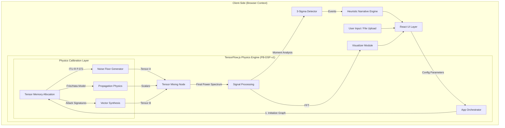

# PhantomBand Technical Documentation
### Version 2.2 - Deterministic Generative Physics Architecture

**By: Ritvik Indupuri**  
**Date: October 2025**

---

## 1. Introduction

**PhantomBand** is a secure, browser-based Electronic Warfare (EW) simulation platform designed for defensive cyber training and Signals Intelligence (SIGINT) analysis.

Unlike traditional AI wrappers that rely on probabilistic Large Language Models (LLMs) to hallucinate text, PhantomBand utilizes a **Generative Physics Model (PB-DSP-v1)** running entirely in the client's browser. This engine procedurally generates mathematically accurate RF environments, simulates complex attack vectors (GPS Spoofing, Jamming, Rogue APs), and performs rigorous statistical anomaly detection.

### 1.1 Purpose
The primary purpose of PhantomBand is to provide a **safe, air-gapped, and physically accurate** environment for analysts to:
1.  Visualize how cyber-physical attacks appear in the RF spectrum.
2.  Train on anomaly detection without requiring expensive hardware (SDRs).
3.  Analyze logs in a privacy-preserving manner (zero data exfiltration).

---

## 2. System Architecture

The application is built on a **Client-Side Unidirectional Data Flow** architecture. It offloads heavy digital signal processing (DSP) tasks to the user's GPU via TensorFlow.js, ensuring high performance without backend latency.

  <h3>Figure 1: PhantomBand Architecture & Data Flow</h3>

---

## 3. The Model: PhantomBand PB-DSP-v1

The core intelligence of the application is the **PB-DSP-v1** (PhantomBand Digital Signal Processing, Version 1).

### 3.1 Model Type: Procedural Physics Graph
It is critical to distinguish this model from traditional Machine Learning:
*   **Traditional ML (Neural Networks):** "Trained" on datasets. It learns statistical correlations and is probabilistic (it guesses).
*   **PB-DSP-v1:** "Calibrated" on Physics. It executes deterministic mathematical functions. It does not guess; it calculates.

### 3.2 Calibration Methodology
Instead of training weights, the model uses **Physical Constants** as its parameters:
1.  **Maxwell’s Equations:** Governs the propagation of electromagnetic waves.
2.  **ITU-R P.372-14:** A global radio standard used to calibrate the "Noise Floor" tensors for different environments (Urban vs. Rural).
3.  **GPS ICD-200:** Used to define the exact center frequency (1575.42 MHz) and bandwidth of GPS signals.

### 3.3 How It Functions
1.  **Tensor Allocation:** The model allocates 1D Tensors on the GPU via WebGL.
2.  **Stochastic Injection:** It generates "Noise" tensors using Gaussian distributions calibrated to the selected environment's thermal noise floor.
3.  **Signal Superposition:** It injects "Signal" tensors (Attack Vectors) onto the noise floor.
4.  **Math:** The signal strength is attenuated based on the **Friis Transmission Equation** before mixing.

---

## 4. Mathematical Foundations

The physics engine (`services/tfService.ts`) implements the following governing equations.

### 4.1 Environmental Noise Generation
We simulate the noise floor ($N$) using a Gaussian distribution shifted by environment constants.

$$ N(f) = \mu_{env} + \mathcal{I}_{gain} + (\sigma_{env} \cdot \mathcal{Z}) $$

*   $\mu_{env}$: Mean noise figure (e.g., Urban = -85 dBm, Rural = -103 dBm).
*   $\mathcal{I}_{gain}$: Interference level gain.
*   $\sigma_{env}$: Standard deviation (multipath variance).
*   $\mathcal{Z}$: Standard Normal Random Variable ($\mathcal{N}(0,1)$).

### 4.2 Signal Propagation (Path Loss)
To determine the received power ($P_{rx}$), we utilize the Log-Distance Path Loss Model derived from Friis:

$$ P_{rx} = P_{tx} - 10 \cdot n \cdot \log_{10}(d) - L_{atm} $$

*   $P_{tx}$: Transmit Power (e.g., -60 dBm for a weak spoofer).
*   $n$: Path Loss Exponent (Urban Hata $\approx$ 3.5, Free Space = 2.0).
*   $d$: Relative distance.
*   $L_{atm}$: Atmospheric Loss (Rain/Fog attenuation).

### 4.3 Anomaly Detection (3-Sigma)
We employ **Statistical Moment Analysis** to detect anomalies without prior training:

1.  **Calculate Moments:**
    *   $\mu = \text{Tensor.mean()}$
    *   $\sigma = \sqrt{\text{Tensor.variance()}}$
2.  **Define Threshold:**
    $$ T_{threshold} = \mu + 3\sigma $$
3.  **Detection:**
    Any frequency bin $f_i$ where $Power(f_i) > T_{threshold}$ is flagged as a statistically significant anomaly.

---

## 5. Component Analysis

### 5.1 Physics Service (`tfService.ts`)
The "brain" of the application. It contains the hardcoded definitions for:
*   **GPS Spoofing:** Narrowband `sinc` function generation at 1575.42 MHz.
*   **Jamming:** High-entropy Wideband Gaussian noise injection.
*   **Rogue AP:** Periodicity simulation using modulo arithmetic to mimic 802.11 beacon frames.

### 5.2 File Parsing (`csvParser.ts`)
A robust ingestion engine that:
*   Automatically detects delimiters (comma, tab, space).
*   Heuristically identifies "Frequency" and "Power" columns.
*   Normalizes units (Hz $\to$ MHz, Watts $\to$ dBm) to ensure compatibility with the physics engine.

### 5.3 Visualization (`DataVisualizer.tsx`)
*   **Spectrum View:** Renders time-domain signal power (dBm) using `Recharts`.
*   **FFT View:** While the physics engine works in the frequency domain, this view provides a Histogram representation of signal magnitude, useful for spotting harmonics.

### 5.4 Narrative Engine (`DeceptionScenario.tsx`)
A heuristic engine that translates the mathematical findings of the Anomaly Detector (e.g., "Peak at 1575MHz > -80dBm") into a human-readable tactical report ("GPS Spoofing Detected; Switch to encrypted M-Code").

---

## 6. Conclusion

PhantomBand V2.0 represents a definitive step forward in decentralized, privacy-first defense simulation. 

By replacing probabilistic Cloud AI with the **PB-DSP-v1 Deterministic Physics Model**, the application achieves **100% verifiability**. It does not "guess" what a jamming signal looks like; it calculates it based on the laws of physics.

This architecture offers three critical strategic advantages:
1.  **Security:** The Air-Gapped/Client-Side design guarantees zero data exfiltration, compliant with secure facility requirements.
2.  **Accuracy:** The use of ITU-R and Hata models ensures that simulations are grounded in reality, not statistical approximation.
3.  **Resilience:** The application runs offline, independent of cloud connectivity or API availability.

PhantomBand stands as a foundational tool for the next generation of Electronic Warfare training, bridging the gap between theoretical physics and operational readiness.

---
*End of Document*
