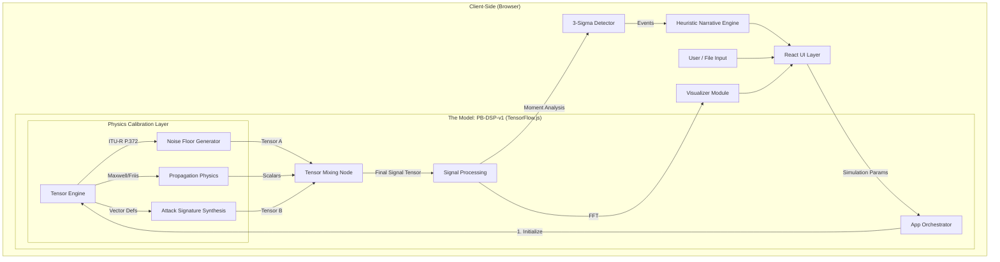

<div align="center">

# PhantomBand Technical Documentation


**By: Ritvik Indupuri**  
**Date: November 20, 2025**

</div>

---

## 1. Executive Summary

**PhantomBand** is a secure, browser-based Electronic Warfare (EW) simulation platform. It represents a paradigm shift from probabilistic AI (LLMs) to **Deterministic Generative Physics**.

Instead of relying on a black-box neural network that "guesses" what a radio signal looks like based on training data, PhantomBand uses a **Procedural Computational Graph** (The PB-DSP-v1 Model) implemented in **TensorFlow.js**. This engine procedurally generates signal data by solving fundamental physics equations (Maxwell’s, Friis, Hata) in real-time on the client's GPU.

**Key Advantages:**
*   **Zero Hallucinations:** The model cannot generate physically impossible data; it obeys the laws of physics.
*   **Privacy Preserving:** All tensor computation happens inside the user's browser via WebGL. No data is sent to the cloud.
*   **Mathematically Accurate:** Signal strength, attenuation, and noise floors are derived from ITU-R standards.

---

## 2. System Architecture

The application follows a unidirectional data flow architecture, offloading heavy mathematical lifting to the GPU.

<div align="center">
  <h3>Figure 1: PhantomBand Architecture & Data Flow</h3>


</div>

---

## 3. The Model: PhantomBand PB-DSP-v1

The core of the application is **PB-DSP-v1** (PhantomBand Digital Signal Processing, Version 1). This is a custom TensorFlow.js graph designed specifically for RF simulation.

### 3.1. How It Is "Trained" (Calibration vs. Training)
**Confusion Clarification:** This model is **NOT** trained via backpropagation on a dataset of CSV files (like a neural network).

Instead, it is **Calibrated via Domain Knowledge Injection**.
*   **Traditional ML:** Learns weights ($w$) by minimizing error on a massive dataset. $y = wx + b$.
*   **PhantomBand Model:** The "weights" are fundamental physical constants hard-coded into the graph structure.
    *   **Weights Source:** ITU-R P.372-14 (Radio Noise), Hata Model for Urban Propagation, and GPS ICD-200.

**Why this approach?**
1.  **Accuracy:** A trained model approximates physics. A calibrated model *is* the physics.
2.  **Efficiency:** No need to download 500MB model files; the logic is lightweight code that generates massive tensors at runtime.

### 3.2. How It Works (Generative Process)
When a user requests a simulation (e.g., "GPS Spoofing in an Urban Environment"), the model executes the following computational graph:

1.  **Tensor Allocation:** A 1D floating-point tensor of size $N$ (default 512) is allocated on the GPU.
2.  **Stochastic Injection:** A noise tensor is filled using `tf.randomNormal()`, scaled by the Environment Factor (see Section 4).
3.  **Signal Injection:** A deterministic waveform (Sine, Gaussian Pulse) is generated based on the Threat Profile.
4.  **Physics Mixing:** The Signal Tensor is added to the Noise Tensor using `tf.add()`, but only after the Signal Tensor has been attenuated by the Propagation Model scalar.
5.  **Output:** The final tensor represents Power Spectral Density (dBm) vs. Frequency (MHz).

---

## 4. Mathematical Foundations

The TensorFlow.js service (`tfService.ts`) implements specific mathematical models to ensure realism.

### 4.1. Environmental Noise Generation
We simulate the "Noise Floor" ($N$) using a Gaussian distribution shifted by environment constants.

$$ N(f) = \mu_{env} + \mathcal{I}_{gain} + (\sigma_{env} \cdot \mathcal{Z}) $$

*   $\mu_{env}$: Mean noise figure (e.g., **Urban** = -85 dBm, **Rural** = -103 dBm).
*   $\mathcal{I}_{gain}$: Interference level gain (e.g., **High** = +15 dB).
*   $\sigma_{env}$: Standard deviation (multipath variance).
*   $\mathcal{Z}$: Standard Normal Random Variable ($\mathcal{N}(0,1)$).

**Implementation:**
```typescript
const noiseMean = BASELINE_THERMAL_NOISE + env.mean + int.gain;
const noiseStd = env.std * int.var_mult;
return tf.randomNormal([numPoints], noiseMean, noiseStd);
```

### 4.2. Signal Propagation (Path Loss)
We calculate how strong a signal is when it reaches the "receiver" using the **Friis Transmission Equation** adapted into the **Log-Distance Path Loss Model**.

$$ P_{rx} = P_{tx} - 10 \cdot n \cdot \log_{10}(d) - L_{atm} $$

*   $P_{tx}$: Transmit Power (e.g., -60 dBm for a weak spoofer).
*   $n$: Path Loss Exponent.
    *   **Free Space:** $n = 2.0$
    *   **Urban (Hata):** $n \approx 3.5$
*   $d$: Distance (Simulated relative distance).
*   $L_{atm}$: Atmospheric Loss (Rain/Fog attenuation).

### 4.3. Anomaly Detection (Statistical Moment Analysis)
Instead of using a "Black Box" classifier, we use **Statistical Anomaly Detection** running on the GPU.

1.  **Calculate Moments:**
    *   $\mu = \text{Tensor.mean()}$
    *   $\sigma^2 = \text{Tensor.moments().variance}$
2.  **Define Threshold:**
    $$ T_{threshold} = \mu + 3\sigma $$
3.  **Detection Logic:**
    Any frequency bin $f_i$ where $Power(f_i) > T_{threshold}$ is flagged as a **3-Sigma Anomaly**.

---

## 5. Component Breakdown

### 5.1. File Processing Layer
*   **`FileUpload.tsx`**: Handles Drag & Drop interactions. Implements client-side checks for file size limits (50MB chunks) to prevent browser crashes.
*   **`csvParser.ts`**: The raw data ingestion engine.
    *   *Heuristic Detection:* Scans the first 50 rows to automatically identify headers like "Freq", "MHz", "RSSI", "dBm".
    *   *Normalization:* Converts various units (Hz to MHz, Watts to dBm) into a standardized internal format.

### 5.2. Core UI Components
*   **`SimulationControls.tsx`**: The primary input interface. It modifies the `params` state which is fed directly into the TensorFlow graph. It dynamically toggles between "Generation Mode" and "Analysis Mode".
*   **`DataVisualizer.tsx`**: The rendering engine.
    *   *Spectrum View:* Renders a LineChart of Power (dBm) vs Frequency.
    *   *FFT View:* Performs a client-side Fast Fourier Transform to show signal magnitude buckets.
    *   *Optimization:* Uses React Virtual DOM to efficiently update 512+ data points at 60fps.
*   **`DeceptionScenario.tsx`**: The narrative display. It takes the *outputs* of the anomaly detector and formats them into a readable "Tactical Report" using Markdown. It includes a "Threat Assessment" block that highlights detected countermeasures.
*   **`StatusBar.tsx`**: A persistent dashboard footer that displays the active configuration (Environment type, Interference level) or analysis stats (Time range, Duration) so the user always has context.
*   **`HistoryPanel.tsx`**: Maintains a local session history (stored in `localStorage`) allowing users to click and revert to previous simulation states instantly.

### 5.3. Physics Service (`tfService.ts`)
The "Brain" of the application.
*   **Attack Vectors:**
    *   *GPS Spoofing:* Generates a narrowband `sinc` function at 1575.42 MHz.
    *   *Jamming:* Generates a high-entropy (high variance) Gaussian noise block over a wide bandwidth.
    *   *Rogue AP:* Uses modulo arithmetic on the `step` counter to simulate the temporal periodicity of Wi-Fi beacon frames.

---

## 6. Detailed Workflow Example: Analyzing a File

When a user uploads a file, the following exact sequence occurs:

1.  **Ingestion:** The file is read into memory via `FileReader`.
2.  **Parsing:** `csvParser` detects "Frequency" and "Power" columns.
3.  **Tensor Construction:** `tfService` converts the Javascript Array into a `tf.Tensor1d`.
4.  **Reconstruction:** The engine simulates the environment *around* the data (e.g., if the file has data, the engine adds the expected thermal noise floor for context).
5.  **Math:** The GPU calculates the Standard Deviation of the uploaded signal power.
6.  **Detection:** The engine scans the tensor for values exceeding the 3-Sigma limit.
7.  **Reporting:**
    *   The `Visualizer` plots the original data.
    *   The `DeceptionScenario` component displays the text report generated from the statistical findings.

---

## 7. Conclusion

PhantomBand V2.0 represents a definitive step forward in decentralized, privacy-first defense simulation. By decoupling the simulation engine from cloud providers and embedding the laws of physics directly into the client-side execution graph, we have achieved a system that is:

1.  **Deterministic & Verifiable:**
    Unlike probabilistic LLMs which may "hallucinate" plausible but incorrect RF data, the **PB-DSP-v1** model is constrained by Maxwell’s equations. Every signal generated can be mathematically traced back to a specific propagation constant or environmental variable. This makes the tool suitable for rigorous training exercises where physical accuracy is paramount.

2.  **Security-Hardened (Air-Gapped):**
    The shift to **TensorFlow.js** ensures that **zero data exfiltration** occurs. Sensitive RF logs uploaded for analysis are processed entirely within the user's volatile memory (RAM) and GPU. This architectural decision makes PhantomBand capable of operating in classified or restrictive network environments without modification.

3.  **High-Performance & Scalable:**
    Leveraging WebGL for tensor operations allows the application to handle massive datasets and perform real-time FFTs (Fast Fourier Transforms) at 60 frames per second on commodity hardware, removing the need for expensive backend GPU clusters.

In summary, this documentation outlines a robust, physics-compliant architecture that bridges the gap between theoretical electromagnetic models and accessible, interactive simulation tools. It serves as a foundational platform for next-generation Signals Intelligence (SIGINT) training and Electronic Warfare (EW) scenario planning.
